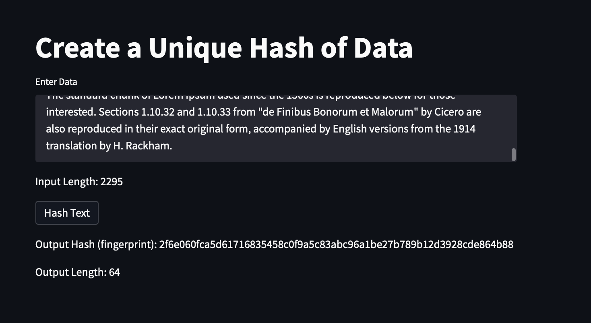

# Improving-data-integrity-with-hashing
An application that uses the hashlib library and Streamlit to hash any text input

Hashing is a cryptograpghy technique that takes a piece of input data and then outputs a fixed- length, mathmetical representation of that data- a hash. 

## Technology
* Streamlit - a Python library that allows developers to quickly build web interfaces fro applications using Python script

To install the above library run the following command in your terminal:
pip install streamlit 

* Hashlib - Python hashlib module is an interface for hashing messages easily. This contains numerous methods which will handle hashing any raw message in an encrypted format. The core purpose of this module is to use a hash function on a string, and encrypt it so that it is very difficult to decrypt it.

## Required libraries and dependencies 

``` python
import hashlib
import streamlit as st
```

## Usage 

To run the app, simply clone tihs github repository to your machine. Navigate to the directory that contains this file and run the following command:

```python
streamlit run hashing_app.py
```


For a better overview of how the app works, refer to the video pushed to this repo.

## Contributors
Brought to you by Ksenia Gorska
  kseniagorska@icloud.com 

[My linkedin profile](https://www.linkedin.com/in/ksenia-gorska/)

## License

MIT
